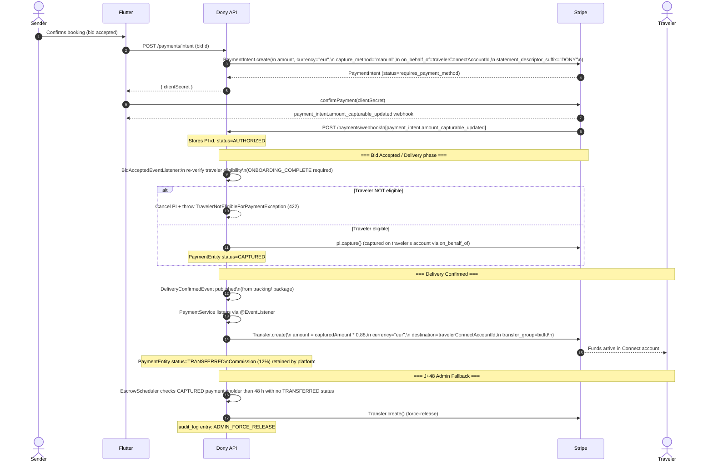

# Payments Flow — Dony Platform

**Last updated:** 2026-05-05 (PR 5 — Stripe Connect `on_behalf_of` migration)

---

## 1. Overview

Dony uses Stripe Connect's **Separate Charges and Transfers** model.

- **Platform account** creates all `PaymentIntent` objects and holds funds after capture.
- **Traveler's Connected account** is the **settlement merchant** (`on_behalf_of`): Stripe legally attributes the charge to the traveler, and their business name appears on the sender's bank statement.
- After delivery is confirmed, the platform performs a **separate `Transfer`** from the platform balance to the traveler's connected account, retaining the 12 % commission.

### Why not `transfer_data[destination]` on the PaymentIntent?

Using `transfer_data[destination]` on the `PaymentIntent` would auto-transfer funds immediately on capture and route the `application_fee` incorrectly. The separate-transfer model gives the platform full control over the timing and amount of the payout, which is required for the escrow-then-release semantics.

---

## 2. End-to-End Flow



### Simplified ASCII summary

```
Sender pays
    └─► PaymentIntent (on_behalf_of=traveler, capture_method=manual)
            │
            ▼  [payment_intent.amount_capturable_updated]
        AUTHORIZED
            │
            ▼  [BidAcceptedEvent + traveler eligible]
        pi.capture()  →  CAPTURED  (funds on platform, settlement on traveler's account)
            │
            ▼  [DeliveryConfirmedEvent]
        Transfer.create(amount × 0.88)  →  TRANSFERRED
            │                         Platform retains 12 % commission
            ▼
        Traveler receives payout

        ── OR ──

        CAPTURED  +  48 h elapsed, no delivery  →  EscrowScheduler force-release
```

---

## 3. Key Invariants

| Rule | Detail |
|------|--------|
| NO `transfer_data[destination]` on PaymentIntent | Would auto-route funds and break commission logic |
| NO `application_fee_amount` on PaymentIntent | Incompatible with separate-transfer model; commission is retained implicitly |
| `capture_method=manual` always | Funds are only captured after bid acceptance + traveler eligibility re-check |
| Capture only after `DeliveryConfirmedEvent` (or J+48 admin) | `PaymentService` listens via `@EventListener`; no direct call from `tracking/` |
| `on_behalf_of` must match the traveler on the bid | Verified at intent creation time; mismatch is a hard error |
| `statement_descriptor_suffix="DONY"` | Ensures sender can identify the charge |
| Commission = 12 % | Configured at `dony.commission.rate=0.12`; exposed via `GET /api/v1/config/commission-rate` |
| Soft-delete only on `PaymentEntity` | Never DELETE; cancelled payments get `status=CANCELLED` |

---

## 4. Webhook Events Handled

All webhooks arrive at `POST /api/v1/payments/webhook` (public endpoint, Stripe signature verified).

| Event | Handler action |
|-------|---------------|
| `payment_intent.amount_capturable_updated` | Update `PaymentEntity` status to `AUTHORIZED`; log to `audit_log` |
| `charge.refunded` | Update `PaymentEntity` status to `REFUNDED`; publish `ChargeRefundedEvent` if needed |
| `account.updated` | Read `charges_enabled + payouts_enabled + requirements.disabled_reason`; derive `StripeAccountStatus`; publish `StripeOnboardingCompletedEvent` on first `ONBOARDING_COMPLETE` transition |

### Signature verification

```java
Webhook.constructEvent(payload, sigHeader, stripeWebhookSecret);
// stripeWebhookSecret from env: STRIPE_WEBHOOK_SECRET
// Never log raw payload in production
```

---

## 5. Error Cases

| Scenario | HTTP status | Exception |
|----------|-------------|-----------|
| Traveler's Connect account not `ONBOARDING_COMPLETE` at capture time | 422 | `TravelerNotEligibleForPaymentException` |
| PaymentIntent capture fails (Stripe error) | 502 | Propagated via `GlobalExceptionHandler` as RFC 7807 |
| Declared value > 500 € | 422 | `DeclaredValueExceededException` |
| Webhook signature mismatch | 400 | Logged + rejected silently (no RFC 7807 body) |

---

## 6. Entities & Status Transitions

```
PaymentEntity.status:
  PENDING → AUTHORIZED → CAPTURED → TRANSFERRED
                    └──► CANCELLED  (traveler ineligible or manual cancel)
                    └──► REFUNDED   (charge.refunded webhook)
```

`audit_log` entries are written for every status transition. The `audit_log` table is immutable (INSERT only — trigger enforced at DB level).
