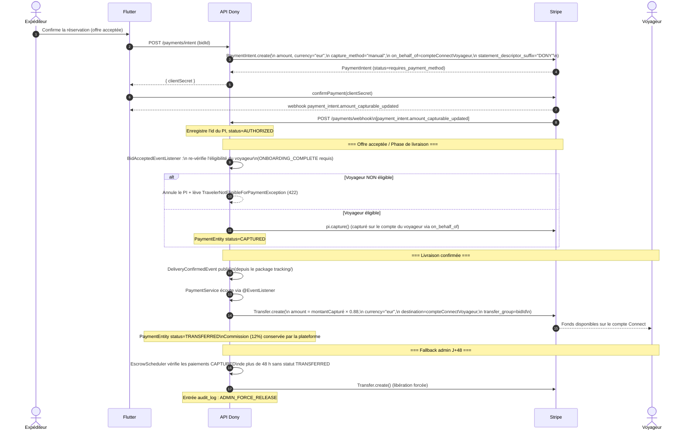

# Flux de paiement — Plateforme Dony

**Dernière mise à jour :** 2026-05-05 (PR 5 — migration Stripe Connect `on_behalf_of`)

---

## 1. Vue d'ensemble

Dony utilise le modèle **Charges séparées et Virements** de Stripe Connect.

- Le **compte plateforme** crée tous les objets `PaymentIntent` et conserve les fonds après capture.
- Le **compte Connect du voyageur** est le **marchand de règlement** (`on_behalf_of`) : Stripe attribue légalement la transaction au voyageur, et le nom de son entreprise apparaît sur le relevé bancaire de l'expéditeur.
- Après confirmation de la livraison, la plateforme effectue un **`Transfer` séparé** depuis le solde de la plateforme vers le compte Connect du voyageur, en conservant la commission de 12 %.

### Pourquoi ne pas utiliser `transfer_data[destination]` sur le PaymentIntent ?

Utiliser `transfer_data[destination]` sur le `PaymentIntent` déclencherait un virement automatique à la capture et achéminerait incorrectement l'`application_fee`. Le modèle de virement séparé donne à la plateforme un contrôle total sur le moment et le montant du paiement, ce qui est nécessaire pour la sémantique d'escrow puis libération.

---

## 2. Flux de bout en bout



### Résumé ASCII simplifié

```
L'expéditeur paie
    └─► PaymentIntent (on_behalf_of=voyageur, capture_method=manual)
            │
            ▼  [payment_intent.amount_capturable_updated]
        AUTHORIZED
            │
            ▼  [BidAcceptedEvent + voyageur éligible]
        pi.capture()  →  CAPTURED  (fonds sur la plateforme, règlement sur le compte du voyageur)
            │
            ▼  [DeliveryConfirmedEvent]
        Transfer.create(montant × 0.88)  →  TRANSFERRED
            │                         Plateforme conserve 12 % de commission
            ▼
        Le voyageur reçoit son paiement

        ── OU ──

        CAPTURED  +  48 h écoulées, pas de livraison  →  EscrowScheduler libération forcée
```

---

## 3. Invariants clés

| Règle | Détail |
|-------|--------|
| PAS de `transfer_data[destination]` sur le PaymentIntent | Achéminerait les fonds automatiquement et casserait la logique de commission |
| PAS d'`application_fee_amount` sur le PaymentIntent | Incompatible avec le modèle de virement séparé ; la commission est conservée implicitement |
| `capture_method=manual` toujours | Les fonds ne sont capturés qu'après acceptation de l'offre et re-vérification de l'éligibilité du voyageur |
| Capture uniquement après `DeliveryConfirmedEvent` (ou admin J+48) | `PaymentService` écoute via `@EventListener` ; pas d'appel direct depuis `tracking/` |
| `on_behalf_of` doit correspondre au voyageur sur l'offre | Vérifié à la création du PaymentIntent ; toute incohérence est une erreur bloquante |
| `statement_descriptor_suffix="DONY"` | Permet à l'expéditeur d'identifier le prélèvement |
| Commission = 12 % | Configurée via `dony.commission.rate=0.12` ; exposée par `GET /api/v1/config/commission-rate` |
| Soft-delete uniquement sur `PaymentEntity` | Jamais de DELETE ; les paiements annulés passent à `status=CANCELLED` |

---

## 4. Événements webhook traités

Tous les webhooks arrivent sur `POST /api/v1/payments/webhook` (endpoint public, signature Stripe vérifiée).

| Événement | Action du handler |
|-----------|------------------|
| `payment_intent.amount_capturable_updated` | Met à jour le statut de `PaymentEntity` à `AUTHORIZED` ; écrit dans `audit_log` |
| `charge.refunded` | Met à jour le statut de `PaymentEntity` à `REFUNDED` ; publie `ChargeRefundedEvent` si nécessaire |
| `account.updated` | Lit `charges_enabled + payouts_enabled + requirements.disabled_reason` ; dérive le `StripeAccountStatus` ; publie `StripeOnboardingCompletedEvent` à la première transition vers `ONBOARDING_COMPLETE` |

### Vérification de la signature

```java
Webhook.constructEvent(payload, sigHeader, stripeWebhookSecret);
// stripeWebhookSecret depuis l'env : STRIPE_WEBHOOK_SECRET
// Ne jamais logger le payload brut en production
```

---

## 5. Cas d'erreur

| Scénario | Statut HTTP | Exception |
|----------|-------------|-----------|
| Compte Connect du voyageur pas à `ONBOARDING_COMPLETE` au moment de la capture | 422 | `TravelerNotEligibleForPaymentException` |
| Échec de la capture du PaymentIntent (erreur Stripe) | 502 | Propagée via `GlobalExceptionHandler` en RFC 7807 |
| Valeur déclarée > 500 € | 422 | `DeclaredValueExceededException` |
| Signature webhook invalide | 400 | Loggée + rejetée silencieusement (pas de corps RFC 7807) |

---

## 6. Entités & transitions de statut

```
PaymentEntity.status :
  PENDING → AUTHORIZED → CAPTURED → TRANSFERRED
                    └──► CANCELLED  (voyageur inéligible ou annulation manuelle)
                    └──► REFUNDED   (webhook charge.refunded)
```

Les entrées `audit_log` sont écrites à chaque transition de statut. La table `audit_log` est immuable (INSERT uniquement — trigger PostgreSQL appliqué au niveau base de données).
